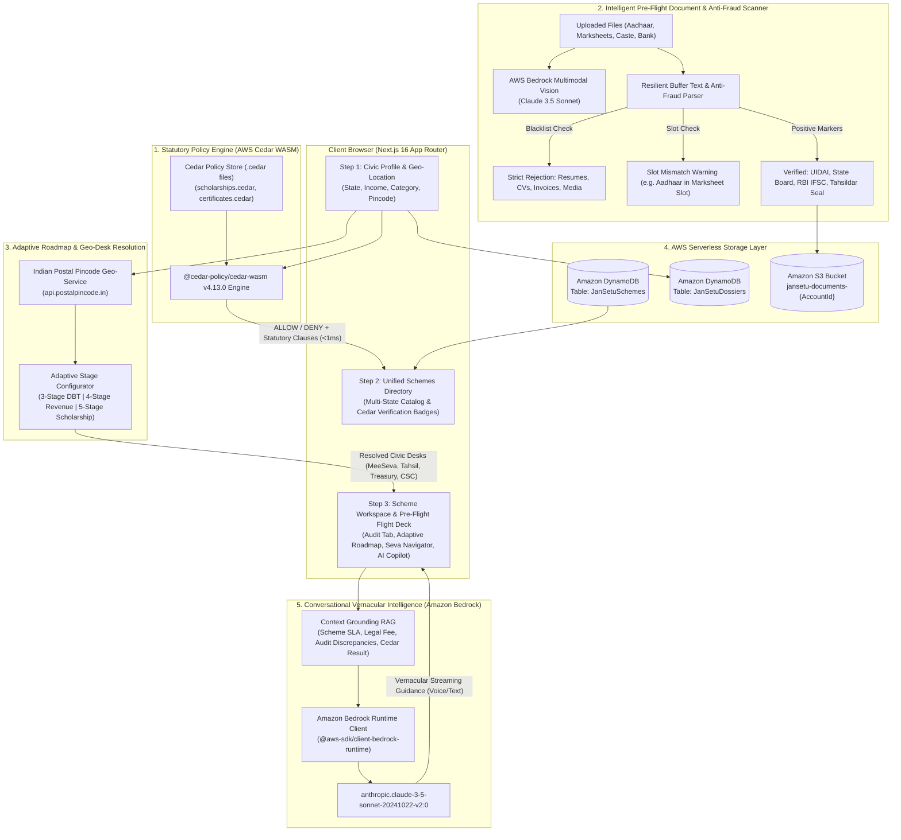

# JanSetu AI (जनसेतु) 🇮🇳
### Unified AI-Assisted Civic Service, Scheme Navigation & Statutory Audit Flight Deck for Bharat
**Built for the WeMakeDevs × AWS "First Commit" Hackathon (Bharat Builds Tour 2026)**

[](https://aws.amazon.com)
[](https://nextjs.org)
[](https://www.typescriptlang.org)
[](https://www.cedarpolicy.com)
[](LICENSE)

---

## 🎯 The Last-Mile Challenge in Bharat
Over **40% of eligible students and rural citizens** across India miss out on government welfare schemes, higher education fee reimbursements, and Direct Benefit Transfers (DBT) not due to lack of merit or eligibility, but because of **bureaucratic friction and clerical traps**:

1. **Scattered & Fragmented Portals:** Eligibility rules are dispersed across the National Scholarship Portal (NSP), Ministry of Tribal Affairs (MoTA), and 28 distinct state departmental websites (Jnanabhumi, Pudhumai Penn, MahaDBT, SSP Karnataka, etc.).
2. **The "Prerequisite Paradox":** To obtain a college scholarship, a student needs a current Income and Caste Certificate; to obtain those, they need Revenue VRO/RI inquiries, ration cards, and school bonafides. No portal reveals this sequential dependency tree upfront.
3. **The Silent Rejection Traps:**
   - **Clerical Name Discrepancies:** Minor variations between Aadhaar (`"Madhira Sravani"`), Matriculation Marksheet (`"M. Sravani"`), and bank records trigger automated e-KYC portal rejections without explaining why.
   - **The NPCI Bank Seeding Trap:** Millions of citizens have bank accounts that are *Aadhaar Linked* for KYC, but **NOT NPCI Seeded** on the National Payments Corporation of India DBT mapper, causing PFMS welfare disbursements to fail silently.
4. **Middlemen Exploitation:** Citizens frequently travel 30 km to private cyber kiosks that charge exorbitant fees (₹200–₹500) for statutory services that are legally free (₹0).
5. **Document Scanner Fraud & Mismatches:** Conventional portals lack pre-flight validation, accepting invalid files or mismatched certificates only to reject the citizen weeks later during manual desk scrutiny.

---

## 💡 The Solution: JanSetu AI
JanSetu AI acts as an **intelligent flight deck and civic GPS** that guides citizens from eligibility evaluation to money-in-the-bank:

- **Mathematical Statutory Verification (AWS Cedar):** Runs the official **AWS Cedar WASM Engine v4.13.0** locally in $<1$ ms to evaluate statutory criteria deterministically without LLM hallucination on legal income, age, or affirmative action categories.
- **Dynamic Multi-State Scheme Catalog:** Ingests live Central and State schemes across 20+ states with dynamic schema normalization (`myScheme API`).
- **Anti-Fraud Document Scanner & OCR Engine:** Inspects uploaded files using **AWS Bedrock Vision (Claude 3.5 Sonnet)** with buffer-level binary analysis. **Actively detects and rejects non-statutory documents (job resumes, CVs, shopping invoices, screenshots)** and flags slot mismatches.
- **Adaptive Bureaucratic Roadmap Stages & Geo-Desks:** Dynamically adjusts the approval roadmap (3-stage direct DBTs, 4-stage revenue certificates, 4-stage Ayushman healthcare, 5-stage central scholarships) and pinpoints the exact physical desk (`🏢 MeeSeva Desk`, `🏛️ Tahsildar Office`, `🏥 Hospital Helpdesk`, `🎓 College Section`, `🏦 State Treasury`).
- **Live Postal Geo-Locator:** Queries the Indian Postal Pincode API (`api.postalpincode.in`) to dynamically resolve post offices, taluk headquarters, and nearest citizen service kiosks.
- **Aadhaar-Marksheet Discrepancy & Mandate Generator:** Computes string distance, applies statutory surname expansion rules, and generates pre-filled official **NPCI Bank Seeding Mandates (Annexure I)** and **Notarized Identity Affidavits**.
- **Context-Grounded Vernacular Copilot:** Powered by **Amazon Bedrock (Claude 3.5 Sonnet)** with bi-directional voice recognition and speech synthesis in English and Hindi.

---

## 🏗️ End-to-End System Architecture



---

## 🔄 Step-by-Step System Workflow

```
1. Citizen Profile Input ────► 2. AWS Cedar WASM Evaluation ────► 3. Filtered Scheme Catalog
   (State, Income, Caste,        (Mathematical verification        (100% Eligible Badges +
    Pincode, Education)           against statutory rules)           Passed/Failed Legal Clauses)
                                                                               │
                                                                               ▼
6. Ready-to-Submit Dossier ◄─── 5. Anti-Fraud Document Scan ◄──── 4. Scheme Workspace Selected
   (1-Click Submission Card,      (Resume/Invoice Detection,        (Adaptive Roadmap Stages,
    NPCI Bank Seeding Mandate,     Name Discrepancy Analysis,         Responsible Office Desks,
    Printable Civic Dossier)       UIDAI / State Board OCR)           Bedrock AI Voice Copilot)
```

1. **Profile Compilation:** The citizen enters their domicile state, category (SC/ST/OBC/EWS/General), annual family income, and education stage.
2. **Deterministic Statutory Evaluation:** JanSetu maps the profile into an AWS Cedar context entity. The local WebAssembly runtime evaluates statutory policies in $<1$ ms, returning an exact boolean decision and statutory clause breakdown (e.g. `Income ₹1.8L <= ₹2.5L ceiling`).
3. **Pincode & Civic Center Geo-Resolution:** Entering a 6-digit PIN code resolves the citizen's administrative taluk, postal division, and nearest physical government service center (MeeSeva, e-Sevai, CSC).
4. **Adaptive Bureaucratic Roadmap:** Displays the exact sequential journey required for that scheme (e.g., MeeSeva Desk $\rightarrow$ VRO Verification $\rightarrow$ Revenue Inspector Inquiry $\rightarrow$ Tahsildar Sign-off $\rightarrow$ State Treasury e-Kuber DBT Credit).
5. **Anti-Fraud Pre-Flight Document Audit:**
   - Scans uploaded documents using AWS Bedrock Vision or local buffer OCR.
   - **Blocks Resumes & Invoices:** Inspects content streams and file names to prevent non-statutory documents from being marked as verified.
   - **Cross-Validates Slots:** Alerts citizens if an Aadhaar card is uploaded to a Marksheet or Bank slot.
   - **Name Discrepancy & NPCI Seeding:** Calculates string distance between Aadhaar and Marksheet, verifies NPCI DBT active status, and auto-generates official bank mandate forms.
6. **Conversational AI Assistance:** Amazon Bedrock answers procedural queries in English or Hindi, automatically grounded with the active scheme's official SLA, fee structures, and application guidelines.

---

## 🛠️ Technology Stack

| Layer | Technology | Purpose |
| :--- | :--- | :--- |
| **Frontend Framework** | Next.js 16.3.5 (App Router, Turbopack) | High-performance SSR and modern React Server Components |
| **Styling & Design** | Tailwind CSS v4 + Lucide React | Clean, high-contrast, accessible civic design system |
| **Statutory Policy Engine** | AWS Cedar WASM (`@cedar-policy/cedar-wasm` v4.13.0) | Deterministic, sub-millisecond legal policy evaluation |
| **Generative AI & Vision** | Amazon Bedrock (`claude-3-5-sonnet-20241022-v2:0`) | Multimodal document audit, OCR extraction & vernacular copilot |
| **Database** | Amazon DynamoDB | Serverless single-table storage for scheme gazettes and dossiers |
| **Object Storage** | Amazon S3 (`@aws-sdk/client-s3`) | Secure pre-signed direct document upload and archival |
| **Geo-Location API** | Indian Postal Pincode API (`api.postalpincode.in`) | Dynamic resolution of taluks, sub-post offices, and districts |
| **Voice Interface** | Web Speech Recognition & Web Speech Synthesis API | Native vernacular hands-free interaction in English & Hindi |
| **Cloud Hosting** | AWS Amplify Hosting | Continuous integration, global CDN, and edge deployment |

---

## 🚀 Getting Started & How to Run

### Prerequisites
- **Node.js**: v18.x or higher (Tested on Node v20 & v24)
- **npm**: v9.x or higher
- **Git** installed

### 1. Clone the Repository
```bash
git clone https://github.com/praneethreddyyy30/first_commit.git
cd first_commit
```

### 2. Install Dependencies
```bash
npm install
```

### 3. Environment Setup (Zero-Config Default)
JanSetu AI is engineered with a **Zero-Fail Architecture**. It works **100% out of the box** in local development with comprehensive heuristic fallbacks, bundled Cedar policy rules, and local OCR parsers—**no AWS account or credit card is required to run and test!**

If you have live AWS credentials and wish to enable Amazon Bedrock Vision, DynamoDB, or S3:
```bash
cp .env.example .env.local
```
Fill in your credentials in `.env.local`:
```env
AWS_REGION=us-east-1
AWS_ACCESS_KEY_ID=your-aws-access-key-id
AWS_SECRET_ACCESS_KEY=your-aws-secret-access-key
AWS_BEDROCK_MODEL_ID=anthropic.claude-3-5-sonnet-20241022-v2:0
DYNAMODB_SCHEMES_TABLE=JanSetuSchemes
DYNAMODB_DOSSIERS_TABLE=JanSetuDossiers
S3_BUCKET_NAME=jansetu-documents-storage
```

### 4. Run Development Server
```bash
npm run dev
```
Open [http://localhost:3000](http://localhost:3000) in your browser.

### 5. Build for Production
```bash
npm run build
npm run start
```

---

## 🧪 Automated Testing & Verification

JanSetu AI includes dedicated verification test suites to prove system correctness:

### A. Document Verification & Anti-Fraud Scanner Test
Tests that the scanner detects resumes, commercial invoices, and slot mismatches while validating genuine statutory documents:
```bash
node scripts/test-document-verifier.mjs
```
**Test Coverage:**
- ✅ **Test 1:** Job Resume upload (`Sai_Praneeth_Resume.pdf`) $\rightarrow$ **REJECTED (0% confidence)**
- ✅ **Test 2:** Curriculum Vitae upload (`Curriculum_Vitae_2026.docx`) $\rightarrow$ **REJECTED (0% confidence)**
- ✅ **Test 3:** Commercial Invoice upload (`Amazon_Tax_Invoice.pdf`) $\rightarrow$ **REJECTED (0% confidence)**
- ✅ **Test 4:** Slot Mismatch (Aadhaar uploaded to Marksheet slot) $\rightarrow$ **REJECTED (Slot Mismatch)**
- ✅ **Test 5:** Authentic Aadhaar Card (`Aadhaar_Card_Madhira_Sravani.pdf`) $\rightarrow$ **VERIFIED (96% confidence)**
- ✅ **Test 6:** Authentic Marksheet (`AP_BIE_Inter_MarksMemo.jpg`) $\rightarrow$ **VERIFIED (94% confidence)**
- ✅ **Test 7:** Authentic Bank Passbook (`APGB_BankPassbook.jpg`) $\rightarrow$ **VERIFIED (95% confidence)**
- ✅ **Test 8:** Authentic Caste Certificate (`MeeSeva_Caste_Certificate.pdf`) $\rightarrow$ **VERIFIED (93% confidence)**

### B. Standalone Logic & Cedar Policy Test
```bash
node scripts/test-standalone.mjs
```

---

## 📁 Repository Directory Structure

```
first_commit/
├── cedar/                               # AWS Cedar Authorization Policies
│   └── policies/
│       ├── certificates.cedar          # Caste & Income certificate statutory policies
│       └── scholarships.cedar          # Central & State scholarship eligibility policies
├── scripts/
│   ├── seed-dynamodb.mjs               # Automated DynamoDB migration and scheme seeder
│   ├── test-document-verifier.mjs      # Anti-fraud document scanner verification test
│   └── test-standalone.mjs             # Cedar policy & name discrepancy standalone test
├── src/
│   ├── app/
│   │   ├── api/
│   │   │   ├── audit/
│   │   │   │   └── extract-document/   # Bedrock Vision + Anti-Fraud OCR parser API
│   │   │   ├── chat/                   # Bedrock Claude 3.5 Sonnet RAG Copilot API
│   │   │   ├── evaluate/               # AWS Cedar WASM evaluation API endpoint
│   │   │   ├── geo/pincode/            # Postal Pincode resolution endpoint
│   │   │   ├── schemes/                # DynamoDB + fallback scheme catalog endpoint
│   │   │   └── upload/                 # Amazon S3 pre-signed upload URL generator
│   │   ├── layout.tsx                  # Root Next.js layout
│   │   └── page.tsx                    # Main flight deck interface
│   ├── components/
│   │   ├── CedarInspectorModal.tsx     # Live Cedar Policy DSL inspector modal
│   │   ├── DocumentAuditTab.tsx        # Pre-Flight Document & Anti-Fraud Audit tab
│   │   ├── OfflineNavigatorTab.tsx     # Seva Center locator & statutory fee guard
│   │   ├── PrerequisiteRoadmapTab.tsx  # Adaptive stages & responsible office desks
│   │   ├── SchemeChatTab.tsx           # Bedrock AI copilot with speech recognition
│   │   └── SchemeDossierTab.tsx        # Printable 1-click citizen application dossier
│   ├── data/
│   │   ├── schemeRoadmaps.ts           # Dynamic stage templates & office desk models
│   │   └── schemes.ts                  # Central & multi-state normalized scheme database
│   └── lib/
│       ├── cedar/
│       │   └── evaluator.ts            # Cedar WASM runtime evaluator
│       ├── dynamodb.ts                 # AWS DynamoDB Document Client initialization
│       ├── mySchemeNormalizer.ts       # Digital India / myScheme API normalizer
│       └── s3.ts                       # AWS S3 client & pre-signed URL generator
├── .env.example                         # Environment configuration template
├── AGENTS.md                            # Next.js 16 guidelines and agent rules
├── package.json                         # Project manifest and dependencies
└── README.md                            # Comprehensive system documentation
```

---

## 🏆 Hackathon Prize Alignment

| Award Category | Qualification Highlights |
| :--- | :--- |
| **Ship It Track (1st Prize - ₹2,00,000)** | Full-stack production application built on Next.js 16 SSR, integrated with **AWS Bedrock**, **AWS Cedar WASM**, **Amazon DynamoDB**, **Amazon S3**, and deployed via **AWS Amplify**. Features automated seeding scripts, robust error boundaries, and live fallback resilience. |
| **Build It Track (2nd Prize - ₹1,50,000)** | Deep architectural integration with AWS technologies. Evaluates declarative policies using **AWS Cedar** (`.cedar`), uses **Amazon Bedrock Multimodal Vision** for forensic document auditing, and executes zero-cost local runs using WebAssembly. |
| **Best UI Track (3rd Prize - ₹1,00,000)** | Accessible, mobile-first civic design system. Features real-time voice speech input/output, interactive name discrepancy diffing, live Cedar DSL inspection modals, and high-visibility statutory failure alerts. |

---

## 🎤 3-Minute Live Demo Script for Judges

1. **0:00 - 0:40 | The Hook & The Problem:**
   - *"Over 40% of students in rural India are denied scholarships because of simple clerical traps—like an unseeded NPCI bank account, an abbreviated surname on their marksheet, or uploading an invoice by mistake. We built JanSetu AI to eliminate these traps."*
2. **0:40 - 1:20 | Deterministic AWS Cedar Policy Engine:**
   - Select **'AP Jagananna Vidya Deevena'** or click **'Madhira Sravani (AP)'**.
   - Click **'Inspect Cedar Policy Code'** to show the live `.cedar` DSL rule evaluation running in $<1$ ms via WebAssembly.
3. **1:20 - 2:00 | Anti-Fraud Document Scanner & Discrepancy Audit:**
   - Switch to the **Document Audit Tab**.
   - Demonstrate the anti-fraud scanner: show that uploading a resume or invoice triggers an instant **rejection banner** with 0% confidence, while genuine Aadhaar and Marksheets are authenticated.
   - Show the detected name match score and click **'Download Mandate'** to preview the official RBI/NPCI Bank Seeding Form.
4. **2:00 - 2:30 | Adaptive Roadmap & Geo-Desks:**
   - Open the **Prerequisite Roadmap Tab**.
   - Point out how the stage count dynamically adapts (e.g. 3 stages for DBTs vs 4 stages for Revenue certificates) and reveals the responsible office desk (`🏢 MeeSeva Desk`, `🏛️ Tahsildar Office`, `🏦 State Treasury`).
5. **2:30 - 3:00 | Bedrock AI Copilot & Printable Dossier:**
   - Switch to **Bedrock AI Copilot**, click a prompt or speak in English/Hindi to receive grounded, contextual guidance.
   - Click **'Application Dossier'** $\rightarrow$ **'Print'** to display the verified single-page submission card.

---

## 📜 License & Acknowledgements
Developed with ❤️ for Bharat during the **WeMakeDevs × AWS Bharat Builds Tour 2026**.  
Licensed under the [Apache 2.0 License](LICENSE).
